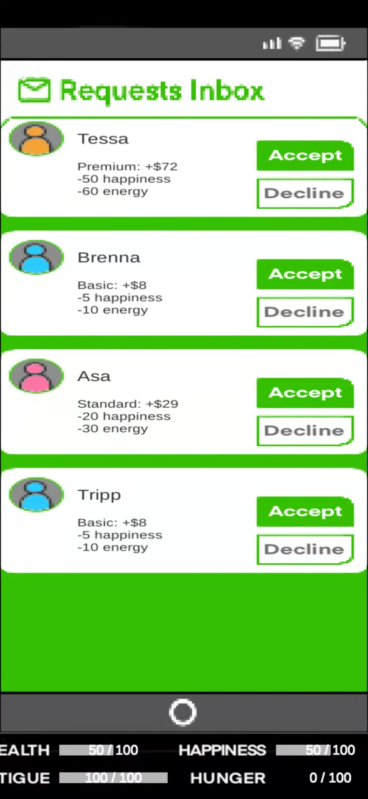

# Self-Isolation-Simulator
BITEC-13 is a pixel-style simulation Unity game inspired by COVID-19. The current version can be played on Android and features in-depth gameplay as well as a wide variety of humorous skits based on real life. Your goal is to make a living through freelance jobs, strategize your resources to ensure your well-being, and maintain a good mood with entertainment apps like games, music, or social media with the ultimate goal of surviving self isolation.

  

    
    
    
    
  

  

    
    
    
    
  

## 
